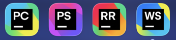

## Bienvenue
Hello je suis Thekorzeremi, bienvenue sur mon profil Github. Je suis un étudiant en M1 DEV, IA et BIG-DATA mais également alternant en tant que développeur logiciel pour des solutions de logiciels de facturation. 
  
Vous pourrez trouver sur mon profil les différentes informations, stacks, statistiques et repositories me concernant. 

## En ce moment
Je travaille actuellement sur plusieurs projets :  
- [IMDF-Builder](https://github.com/Thekorzeremi/IMDF-Builder) : Une plateforme permettant de créer des fichiers IMDF pour Microsoft Places. 
- [Hackathon-MIA](https://github.com/marcyannick1/hackaton-mia) : Un projet hackathon dont l'objectif est de créer une plateforme de tri et conformité de documents pour entreprise.
- **Projet d'entreprise privé** : Implémentation de nouvelles fonctionnalités et correction diverses sur une plateforme de logiciel de facturation.

## Technologies que j'utilise
| Type    | Techno                                                                                                                                                                                                                                                                                                                                                                                                                                |
|---------|---------------------------------------------------------------------------------------------------------------------------------------------------------------------------------------------------------------------------------------------------------------------------------------------------------------------------------------------------------------------------------------------------------------------------------------|
| Backend |                                                                                                                                           |
| Base de données |                                                                                                                                                                                                      |
| Frontend |                                                                                                                                                                                                                |
| Style |                                                                                                                                                                                                                                               |
| DevOps |                                                                                                                                                                                                                                                         |
| Autres |        |

## Statistiques
|Type| Badge                                                                                                                                               |
|-----|-----------------------------------------------------------------------------------------------------------------------------------------------------|
| Temps passé à taper du code depuis la création du compte |  |
| Nombre de repos créés depuis la création du compte | 25 repositories |
| Nombre d'années depuis la création du compte | +3 ans |

## Mon setup
J'utilise la suite d'IDE Jetbrains :  
  
Et je suis sous MacOS.

## Enfin
Vous trouverez ci-dessous certains des projets auxquels j’ai contribué ou que j’ai créés :